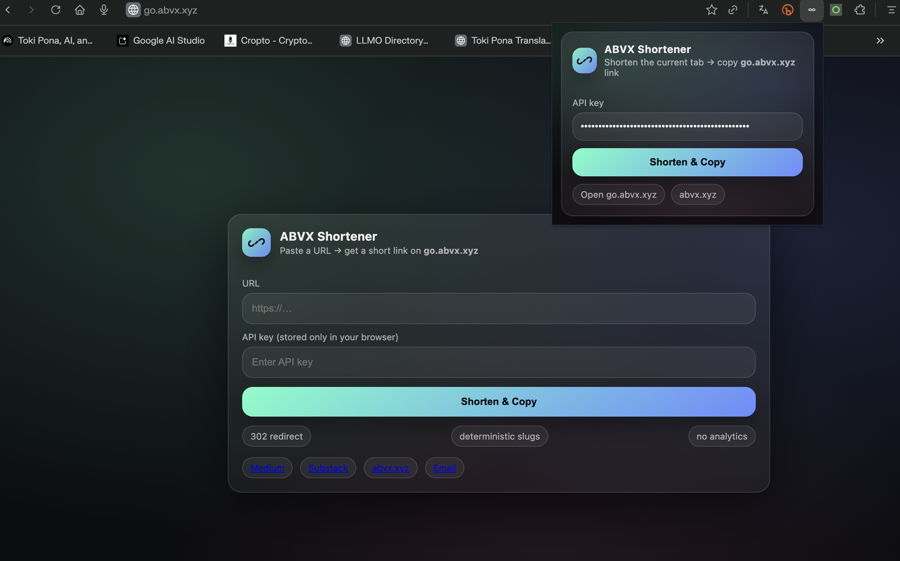

# ABVX Shortener

[](./LICENSE)
[](https://developers.cloudflare.com/workers/)
[](https://developer.chrome.com/docs/extensions/)

**License:** MIT. See [LICENSE](LICENSE).

A minimal, self-hosted URL shortener for your own domain (**Cloudflare Workers + KV**) + a Chrome extension that shortens the current tab URL and copies it.

- No analytics
- Deterministic slugs (same URL → same short link)
- Simple auth with an API key



---

## How it works
- `GET /:slug` → **302** redirect to the stored long URL
- `POST /api/shorten` → stores `slug → url` in Cloudflare KV and returns `{ slug, shortUrl }`

## Repo structure
- `worker/` — Cloudflare Worker
- `extension/` — Chrome extension (Manifest V3)

---

## Quick start (Cloudflare)
### 1) Install
```bash
cd worker
npm i
```

### 2) Login
```bash
npx wrangler login
```

### 3) Create KV namespace
```bash
npx wrangler kv namespace create "LINKS"
```
Copy the namespace id into `worker/wrangler.toml` under `kv_namespaces`.

### 4) Set API key secret
```bash
npx wrangler secret put API_KEY
```

### 5) Deploy
```bash
npx wrangler deploy
```

### 6) Custom domain
Recommended: use a subdomain like `go.yourdomain.com`.

Cloudflare Dashboard → Workers & Pages → your worker → **Triggers → Custom Domains**.

---

## Chrome extension (Load unpacked)
1) Open `chrome://extensions`
2) Enable **Developer mode**
3) Click **Load unpacked**
4) Select the `extension/` folder

The extension will:
- read current tab URL
- call `POST https://go.abvx.xyz/api/shorten`
- copy the short URL to clipboard

---

## API
### Health
```bash
curl https://go.abvx.xyz/health
```

### Shorten
```bash
curl -X POST "https://go.abvx.xyz/api/shorten" \
  -H "Content-Type: application/json" \
  -H "X-API-Key: <your-key>" \
  -d '{"url":"https://example.com/some/long/path?x=1"}'
```

---

## Notes / security
This is intended for personal use.

- The API key is stored in the extension, so treat it as “good enough for personal workflows”, not bank-grade security.
- Optional hardening: Cloudflare WAF / rate limiting for `POST /api/shorten`.

---

## License
MIT — see [LICENSE](./LICENSE).
