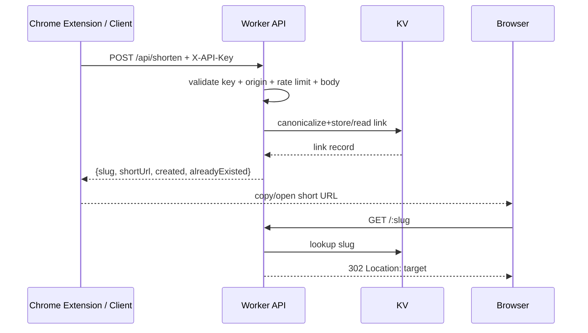

# ABVX Shortener

[](./LICENSE)
[](https://developers.cloudflare.com/workers/)
[](https://developer.chrome.com/docs/extensions/)

Minimal, self-hosted URL shortener for Cloudflare Workers + KV with an opinionated, controllable management layer.

- Deterministic slugs by default
- Managed links: create/read/update/delete metadata
- Optional TTL / custom slug / overwrite semantics
- Security controls for API and extension usage

---

## Contents

- [How it works](#how-it-works)
- [Quick start (Worker)](#quick-start-worker)
- [Chrome extension](#chrome-extension)
- [API v0.2](#api-v02)
- [Configuration](#configuration)
- [Threat model](#threat-model)
- [Release notes](#release-notes)
- [Migration `v0.1 -> v0.2`](#migration-v01--v02)

---

## How it works

- `GET /health` -> liveness
- `POST /api/shorten` -> create/reuse short link
- `GET /api/link/:slug` -> return link metadata
- `PUT /api/link/:slug` -> update link
- `DELETE /api/link/:slug` -> soft-delete (`disabled=true`)
- `GET /:slug` -> 302 redirect

Flow:


```mermaid
sequenceDiagram
  participant E as Chrome Extension / Client
  participant W as Worker API
  participant K as KV
  participant R as Browser

  E->>W: POST /api/shorten + X-API-Key
  W->>W: validate key + origin + rate limit + body
  W->>K: canonicalize+store/read link
  K-->>W: link record
  W-->>E: {slug, shortUrl, created, alreadyExisted}
  E-->>R: copy/open short URL
  R->>W: GET /:slug
  W->>K: lookup slug
  W-->>R: 302 Location: target
```

---

## Quick start (Cloudflare)

```bash
cd worker
npm i
```

```bash
npx wrangler login
```

```bash
npx wrangler kv namespace create "LINKS"
```

- put namespace id into `worker/wrangler.toml`

```bash
npx wrangler secret put API_KEY
```

```bash
npx wrangler deploy
```

---

## Chrome extension (Load unpacked)

1) `chrome://extensions`
2) enable **Developer mode**
3) **Load unpacked**
4) select `extension/`

Now the popup supports:

- custom endpoint (`https://your-shortener.domain`)
- API key persistence in local extension storage
- optional custom slug
- overwrite flag
- TTL
- preview before copy
- copy/open/retry actions
- recent history (10–20 entries)

Security note: extension requests are expected over HTTPS.

---

## API v0.2

All API endpoints return JSON for errors with `error` object shape:

```json
{ "code": "bad_request|unauthorized|forbidden|not_found|method_not_allowed|conflict|rate_limited|internal_error", "message": "...", "requestId": "..." }
```

### `POST /api/shorten`

```bash
curl -X POST "$BASE/api/shorten" \
  -H "Content-Type: application/json" \
  -H "X-API-Key: <your-key>" \
  -d '{"url":"https://example.com","customSlug":"my-link","overwrite":true,"ttl":3600}'
```

Body fields:

- `url` (required)
- `customSlug` (optional)
- `overwrite` / `force` (optional)
- `ttl` (optional, seconds)
- `expiresAt` (optional ISO string)

Response:

```json
{ "slug":"abc123", "shortUrl":"https://go.abvx.xyz/abc123", "created":true, "alreadyExisted":false }
```

### `GET /api/link/:slug`

Returns metadata (requires API key):

```json
{ "slug":"abc123", "url":"https://example.com", "createdAt":169..., "updatedAt":169..., "createdBy":"key-hash", "expiresAt":169..., "disabled":false, "customSlug":false }
```

### `PUT /api/link/:slug`

Update URL / status / expiry. If changing URL without overwrite-like flags, returns `409`.

### `DELETE /api/link/:slug`

Soft delete by default (`disabled=true`).
Hard delete by appending `?hard=true`.

### Redirect `GET /:slug`

Responds with `302` to target.

---

## Configuration

| Variable | Default | Description |
| --- | --- | --- |
| `BASE_URL` | `https://go.abvx.xyz` | Base URL for returned short links |
| `RATE_LIMIT_WINDOW_SEC` | `60` | Rate-limit window in seconds |
| `RATE_LIMIT_MAX` | `30` | Rate-limit max requests per window |
| `ALLOWED_ORIGINS` | `` | Comma-separated allowlist for browser origin/referer |
| `ALLOW_NO_ORIGIN` | `false` | Allow requests without origin/referer when true |
| `STRIP_TRAILING_SLASH` | `true` | Remove trailing slash before hashing |
| `MAX_URL_LENGTH` | `2048` | Maximum accepted URL length |
| `DEFAULT_TTL_SECONDS` | `0` | Optional default TTL, in seconds |

`API_KEY` must be configured as secret.

---

## Threat model

- API is protected by `X-API-Key` and server-side validation.
- Browser client origin/referer allowlist and `ALLOW_NO_ORIGIN` are controls for non-browser integrations.
- URL validation blocks non-HTTP/S and common local/private/loopback hosts.
- Rate limits protect `/api/shorten` by IP + key.
- Links are canonicalized before hashing to reduce duplicates.
- Soft-delete preserves history by default.

What this does not do:

- No analytics, no geofencing, no anti-phishing scoring, no click-level auth.
- No user/session management beyond shared API key.

---

## Compatibility

- Worker: Cloudflare Workers runtime only
- Extension: Chrome Manifest V3 (also works on Chromium browsers compatible with MV3)

---

## Migration `v0.1 -> v0.2`

- data storage changed from raw URL string to JSON link record in KV
- added API management endpoints and extension config/history
- added URL hardening/rate control and standardized errors

Existing v0.1 records (old raw URL values) are lazily migrated on first read.

### Production-safe KV migration (bulk v0.1 legacy format -> v0.2 JSON)

The migration script is intentionally conservative and idempotent for legacy records.
Use this runbook for safer execution and easy rollback verification.

```bash
cd worker

export KV_NAMESPACE_ID=<your-kv-namespace-id>
export CLOUDFLARE_ACCOUNT_ID=<your-cloudflare-account-id>
export CLOUDFLARE_API_TOKEN=<api-token-with-kv-edit>
export MIGRATE_CREATED_BY="v0.2-migration"
export DEFAULT_TTL_SECONDS=0
```

Optional controls:

- `MAX_KEYS` — process at most N keys (for smoke checks)
- `LIMIT` — page size for KV list calls (default 1000, max 1000)
- `DRY_RUN=true` — validate what will change without writing

#### 1) Pre-flight check (no writes)

```bash
DRY_RUN=true \
MAX_KEYS=20 \
LIMIT=100 \
node ./scripts/migrate-kv.mjs \
  2>&1 | tee migration-dryrun-$(date +%F_%H%M%S).log
```

Expect:

- script prints usage summary without error
- nonzero counters only for `skipped_*` are normal
- no write actions in `DRY_RUN` mode

#### 2) Controlled production run (small canary)

```bash
MAX_KEYS=200 \
LIMIT=100 \
node ./scripts/migrate-kv.mjs \
  2>&1 | tee migration-canary-$(date +%F_%H%M%S).log
```

Inspect output:

- `migrated` should be > 0 and `skipped_already_normalized` should increase after reruns
- verify sample keys in worker:

```bash
wrangler kv key list --namespace-id "$KV_NAMESPACE_ID" --limit 5
```

#### 3) Full rollout

Run in controlled windows:

```bash
MAX_KEYS=10000 \
LIMIT=1000 \
node ./scripts/migrate-kv.mjs \
  2>&1 | tee migration-prod-$(date +%F_%H%M%S).log
```

You can rerun in smaller chunks using a lower `MAX_KEYS` until all records are migrated.
Because already normalized records are skipped, repeated runs are safe.

#### 4) Post-run checks

- Search log for `Migration failed` or script exit code != `0`.
- Confirm redirect behavior for a migrated slug from the old dataset.
- Keep migration logs for audit/compliance.

---

## Release notes

See `CHANGELOG.md`.
